# Class Diagram

This diagram documents the project-specific architecture in `examples/example_sdl3_vulkan`.
It intentionally focuses on the fork-owned application classes and leaves upstream Dear ImGui,
SDL3, Vulkan, and the test engine collapsed as external dependencies so the structure stays readable.

Raw Mermaid source: `CLASS_DIAGRAM.mmd`

```mermaid
classDiagram
    direction LR

    %% See CLASS_DIAGRAM.mmd for the maintained Mermaid source.

    class MainLoop {
        <<entrypoint>>
        +main()
    }

    class SDLWindow {
        +SDL_Window* Window
        +float MainScale
        +bool Init(title, width, height)
        +vector~const char*~ GetVulkanExtensions()
        +VkSurfaceKHR CreateVulkanSurface(instance, allocator)
        +void GetSize(w, h)
        +void Show()
        +bool IsMinimized()
        +void PollEvents(done, imgui)
        +void Shutdown()
    }

    class VulkanContext {
        +VkInstance Instance
        +VkPhysicalDevice PhysicalDevice
        +VkDevice Device
        +VkQueue Queue
        +ImGui_ImplVulkanH_Window MainWindowData
        +void Setup(instance_extensions)
        +void SetupWindow(surface, width, height)
        +ImGui_ImplVulkan_InitInfo MakeInitInfo()
        +void RebuildSwapchainIfNeeded(width, height)
        +void SetClearColor(color)
        +void FrameRender(draw_data)
        +void FramePresent()
        +void WaitIdle()
        +void CleanupWindow()
        +void Cleanup()
    }

    class ImGuiLayer {
        +bool ShowDemoWindow
        +bool ShowAnotherWindow
        +bool ShowDebugLogMirrorWindow
        +bool ShowTerminalWindow
        +bool ShowTestEngineWindow
        +bool RequestQuit
        +ImVec4 ClearColor
        +ImGuiDebugLogMirror DebugLogMirror
        +vector~TerminalTab~ Terminals
        +void AddTerminal(name)
        +void Init(window, init_info, main_scale)
        +void ProcessEvent(event)
        +void NewFrame()
        +void BuildUI()
        +void Render()
        -void WireTerminalCallbacks(c)
        -void DrawTerminals()
    }

    class TerminalTab {
        +string name
        +unique_ptr~ConsoleCommands~ console
        +bool open
    }

    class ImGuiDebugLogMirror {
        +bool Open(path)
        +void Close()
        +bool IsOpen()
        +const char* GetPath()
        +void Tick()
        +void ShowWindow(p_open)
        +ImGuiDebugLogFlags GetFlags()
        +void SetFlags(flags)
    }

    class ImGuiConsole {
        +void ClearLog()
        +void AddLog(line)
        +void AddLogThreadSafe(line)
        +void Draw(title, p_open)
        +void DrawContents(id)
        +void RegisterCommand(name, description, fn)
        +void ExecCommand(command_line)
        #vector~string~ Items
        #vector~ConsoleCommandDef~ Commands
        #vector~string~ History
        -vector~string~ PendingLines_
        -shared_ptr~BashSession~ ActiveBashSession_
    }

    class ConsoleCommands {
        +function~void()~ OnQuit
        +function~void(bool)~ OnDemoToggle
        +function~void(int)~ OnStyleChange
    }

    class ConsoleCommandArgs {
        +string_view name
        +vector~string~ args
        +string_view raw_args
    }

    class ConsoleCommandDef {
        +string name
        +string description
        +ConsoleCommandFn fn
    }

    class BashSession {
        <<internal>>
    }

    class TestEngineLayer {
        +ImGuiTestEngine* Engine
        +void Init()
        +void Stop()
        +void Shutdown()
        +void PostSwap()
        +void BuildUI(p_open)
        -void RegisterTests()
    }

    class DearImGuiCore {
        <<external>>
    }

    class ImGuiSDL3Backend {
        <<external>>
    }

    class ImGuiVulkanBackend {
        <<external>>
    }

    class ImGuiTestEngineExternal {
        <<external>>
    }

    MainLoop *-- SDLWindow : owns
    MainLoop *-- VulkanContext : owns
    MainLoop *-- ImGuiLayer : owns
    MainLoop *-- TestEngineLayer : owns

    SDLWindow ..> ImGuiLayer : forwards SDL events
    SDLWindow ..> VulkanContext : creates Vulkan surface for
    VulkanContext ..> ImGuiLayer : provides renderer init info to

    ImGuiLayer *-- ImGuiDebugLogMirror : owns
    ImGuiLayer *-- TerminalTab : stores tabs
    TerminalTab *-- ConsoleCommands : owns

    ConsoleCommands --|> ImGuiConsole : extends
    ImGuiConsole o-- ConsoleCommandDef : registry of
    ConsoleCommandDef ..> ConsoleCommandArgs : consumes
    ImGuiConsole o-- BashSession : tracks active

    ImGuiLayer ..> DearImGuiCore : manages context for
    ImGuiLayer ..> ImGuiSDL3Backend : initializes
    ImGuiLayer ..> ImGuiVulkanBackend : initializes
    VulkanContext ..> ImGuiVulkanBackend : supplies init data to
    TestEngineLayer ..> ImGuiTestEngineExternal : wraps lifecycle of
```

## Comments

- `MainLoop` in `main.cpp` is intentionally thin. It creates the four major layers, runs the frame loop, and enforces the shutdown order.
- `SDLWindow` isolates platform concerns: SDL startup, native window ownership, DPI scaling, event polling, and Vulkan surface creation.
- `VulkanContext` owns the raw Vulkan state and swapchain-related resources. The rest of the app treats it as a rendering service rather than touching Vulkan handles directly.
- `ImGuiLayer` is the application-facing UI layer. It owns the Dear ImGui context, both ImGui backends, the debug-log mirror, and the terminal tabs.
- `ImGuiDebugLogMirror` is deliberately small and self-contained. It tails Dear ImGui's internal debug buffer into a file without spreading file I/O logic through the UI layer.
- `TerminalTab` is just a lightweight ownership wrapper. Its purpose is to let the UI manage multiple independent terminal instances without duplicating console state in `ImGuiLayer`.
- `ImGuiConsole` is the reusable terminal widget. It handles rendering, command history, parsing, completion, log buffering, and thread-safe message ingestion.
- `ConsoleCommands` adds application-specific behavior on top of `ImGuiConsole`. Inheritance is used here to pre-register concrete commands such as `HELP`, `BASH`, `COPILOT`, `STYLE`, and `QUIT`.
- `ConsoleCommandArgs` and `ConsoleCommandDef` are value types that keep command parsing and dispatch data-driven instead of hard-wiring every command into the input widget.
- `BashSession` stays opaque in the header because PTY/session machinery is an implementation detail of the console subsystem.
- `TestEngineLayer` is kept separate from `ImGuiLayer` so the optional `imgui_test_engine` integration does not pollute the main UI layer with test-runner lifecycle code.
- External nodes are shown as collapsed boxes because they are dependencies, not project-owned classes. Expanding upstream Dear ImGui and backend internals would overwhelm the diagram.

## Scope Note

This is the most useful project-level class diagram for this fork because the rest of the repository is largely upstream Dear ImGui source. If needed, a second diagram can zoom into one subsystem, such as the terminal/PTY implementation or the frame lifecycle.
